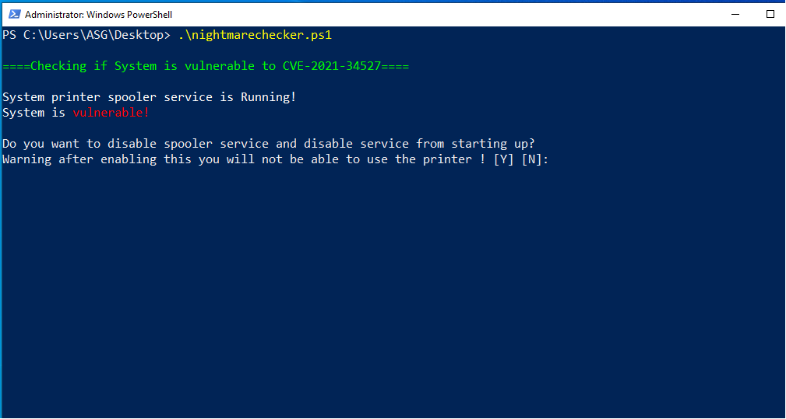
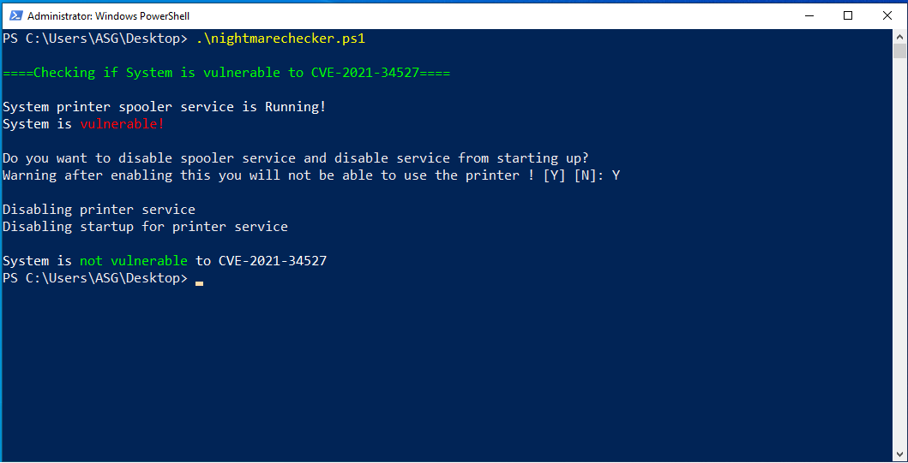

# PrintNightMareChecker
* Quick check to see if Spooler is on and whether is it vulnerable to CVE 2021-34527
* nightmarechecker.os1 checks and do a quick fixed to the vulnerability
* reset.ps1 enable the Spooler service to allow printing

# Screenshot

  
  
  

